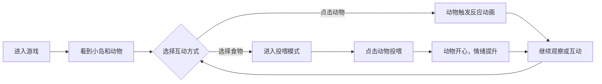

## 1. 产品概述

情绪动物园是一款治愈系互动小游戏，玩家进入一座手绘风格的小岛，与几只代表不同情绪的小动物互动玩耍。通过点击、喂食等方式与动物互动，观察它们的情绪变化和可爱动画，营造一个"会呼吸的小世界"。

- 核心目标：提供轻松愉悦的互动体验，通过萌系小动物和情绪表达带来治愈感
- 目标用户：喜欢治愈系、萌系小游戏的用户，想要放松心情的各年龄段玩家

## 2. 核心功能

### 2.1 用户角色

| 角色 | 注册方式 | 核心权限 |
|------|----------|----------|
| 玩家 | 无需注册，直接进入 | 与动物互动、喂食、观察情绪变化 |

### 2.2 功能模块

1. **小岛主场景**：手绘风格的岛屿背景，包含草地、树木、小池塘、花朵等装饰元素
2. **情绪动物角色**：3只代表不同情绪的小动物（开心的小兔、生气的小刺猬、困倦的小熊）
3. **点击互动系统**：点击动物触发反应动画和情绪变化
4. **Idle 动画系统**：动物有呼吸、眨眼、摇摆等自然待机动画
5. **移动动画系统**：动物在岛上缓慢移动，有自然的行走轨迹
6. **喂食系统**：投喂食物让动物开心，情绪状态提升
7. **情绪状态系统**：开心、生气、困倦三种情绪状态，各有不同的表情和动画

### 2.3 页面详情

| 页面名称 | 模块名称 | 功能描述 |
|----------|----------|----------|
| 主游戏页面 | 岛屿背景 | 手绘风格的小岛场景，有天空、云朵、草地、树木、池塘 |
| 主游戏页面 | 动物角色区 | 3只小动物在岛上自由活动，可点击互动 |
| 主游戏页面 | 喂食工具栏 | 底部食物选择栏，点击选择食物后投喂给动物 |
| 主游戏页面 | 情绪指示器 | 每只动物头顶显示当前情绪状态的小图标 |
| 主游戏页面 | 标题区域 | 游戏名称"情绪动物园"和简短介绍文字 |

## 3. 核心流程

玩家进入游戏 → 看到小岛上的三只小动物在活动 → 点击动物观察反应 → 选择食物投喂 → 动物情绪变化 → 继续互动或观察

## 4. 用户界面设计

### 4.1 设计风格

- **整体风格**：手绘感、轻动画、治愈系、像会呼吸的小世界
- **主色调**：柔和的马卡龙色系 - 天空蓝 (#87CEEB)、草地绿 (#90EE90)、樱花粉 (#FFB6C1)、柠檬黄 (#FFFACD)
- **辅助色**：薰衣草紫 (#E6E6FA)、蜜桃橙 (#FFDAB9)、薄荷绿 (#98FB98)
- **字体**：圆润可爱的字体，标题使用有手绘感的字体，正文使用清晰易读的圆体
- **按钮风格**：圆润的胶囊形按钮，带有轻微的阴影和弹跳动画
- **图标风格**：手绘风格的 emoji 或 SVG 图标，线条圆润
- **动画风格**：缓慢柔和的过渡，有呼吸感，避免快速生硬的动画

### 4.2 页面设计概述

| 页面名称 | 模块名称 | UI 元素 |
|----------|----------|----------|
| 主游戏页面 | 标题区域 | 游戏名称手写体大字，下方小字说明，淡入动画 |
| 主游戏页面 | 岛屿背景 | 分层视差效果：天空(最远)、云朵、远山、草地(最近)，有轻微呼吸动画 |
| 主游戏页面 | 动物角色 | 圆润可爱的手绘造型，每只动物有独特的颜色和造型，带阴影和光晕 |
| 主游戏页面 | 情绪指示器 | 动物头顶的小气泡图标，显示当前情绪（开心😊、生气😠、困倦😴） |
| 主游戏页面 | 喂食工具栏 | 底部半透明毛玻璃效果的工具栏，几种食物图标横向排列 |
| 主游戏页面 | 互动反馈 | 点击时出现的爱心、星星等小粒子特效，向上飘散消失 |

### 4.3 响应性

- 桌面端优先设计，适配平板和手机
- 移动端自适应布局，工具栏在底部更易触达
- 触摸操作优化，确保点击区域足够大

### 4.4 动画细节

- **呼吸动画**：所有元素有轻微的缩放和上下浮动，模拟呼吸感
- **走路动画**：动物移动时身体上下轻微起伏，尾巴/耳朵摆动
- **Idle 动画**：眨眼、耳朵微动、偶尔打哈欠
- **情绪变化**：表情渐变过渡，身体颜色轻微变化
- **喂食动画**：食物飞向动物嘴边，动物咀嚼动作，然后出现爱心特效
- **背景动画**：云朵缓慢飘动，树叶轻微摇晃，水面波纹
