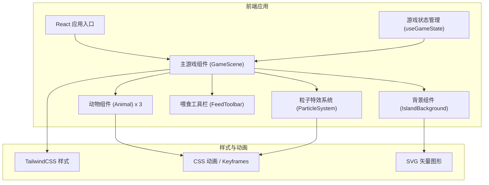

## 1. 架构设计



## 2. 技术描述

- **前端框架**：React@18 + TypeScript + Vite
- **样式方案**：TailwindCSS@3 + CSS Modules / 内联样式
- **动画实现**：CSS Keyframes + React 状态驱动动画
- **图形绘制**：纯 SVG 矢量图形（手绘风格动物和场景元素）
- **初始化工具**：Vite (React + TypeScript 模板)
- **后端**：无后端，纯前端游戏
- **数据存储**：无持久化存储，游戏状态保存在内存中

## 3. 路由定义

| 路由 | 用途 |
|------|------|
| / | 主游戏页面，包含所有游戏内容 |

单页面应用，无需多路由。

## 4. 核心数据模型

### 4.1 动物数据模型

```typescript
interface Animal {
  id: string;
  name: string;
  type: 'rabbit' | 'hedgehog' | 'bear';
  emotion: 'happy' | 'angry' | 'sleepy';
  position: { x: number; y: number };
  targetPosition: { x: number; y: number } | null;
  isMoving: boolean;
  hunger: number; // 0-100，越高越饿
  happiness: number; // 0-100，越高越开心
  lastFedTime: number;
  animationState: 'idle' | 'walking' | 'eating' | 'reacting';
}
```

### 4.2 游戏状态

```typescript
interface GameState {
  animals: Animal[];
  selectedFood: FoodType | null;
  particles: Particle[];
  timeOfDay: 'day'; // 简化版只有白天
}

type FoodType = 'carrot' | 'apple' | 'fish' | 'honey';

interface Particle {
  id: string;
  type: 'heart' | 'star' | 'sparkle';
  x: number;
  y: number;
  createdAt: number;
}
```

## 5. 组件划分

| 组件名 | 文件路径 | 职责描述 |
|--------|----------|----------|
| App | src/App.tsx | 应用入口，渲染主游戏场景 |
| GameScene | src/components/GameScene.tsx | 主游戏容器，管理游戏状态和逻辑 |
| IslandBackground | src/components/IslandBackground.tsx | 小岛背景，包含天空、云朵、草地、树木等 |
| Animal | src/components/Animal.tsx | 单个动物角色，处理动画和交互 |
| AnimalSprite | src/components/AnimalSprite.tsx | 动物 SVG 图形，根据情绪和状态变化 |
| FeedToolbar | src/components/FeedToolbar.tsx | 底部喂食工具栏，选择食物 |
| EmotionBubble | src/components/EmotionBubble.tsx | 动物头顶的情绪气泡指示器 |
| Particle | src/components/Particle.tsx | 单个粒子特效（爱心、星星等） |
| useGameState | src/hooks/useGameState.ts | 游戏状态管理 Hook |
| useAnimalAI | src/hooks/useAnimalAI.ts | 动物 AI 行为（移动、情绪变化） |

## 6. 动画实现方案

### 6.1 CSS 动画

- `breathing` - 呼吸动画（缩放 + 上下浮动）
- `float` - 漂浮动画
- `walking` - 走路动画（身体起伏）
- `blink` - 眨眼动画
- `bounce` - 弹跳反应
- `float-up` - 粒子向上飘散
- `cloud-drift` - 云朵飘动
- `sway` - 树叶摇晃

### 6.2 状态驱动动画

- 动物移动：通过 React state 更新 position，配合 CSS transition
- 情绪变化：切换 CSS class，触发过渡动画
- 喂食交互：食物从工具栏飞向动物，使用 CSS transform 动画

## 7. 性能优化

- 使用 CSS 动画而非 JS 动画，减少重排重绘
- 动物数量控制在 3 只，确保流畅
- 粒子特效自动清理，避免内存泄漏
- SVG 矢量图形保证清晰度同时体积小
- 使用 React.memo 优化不必要的重渲染
